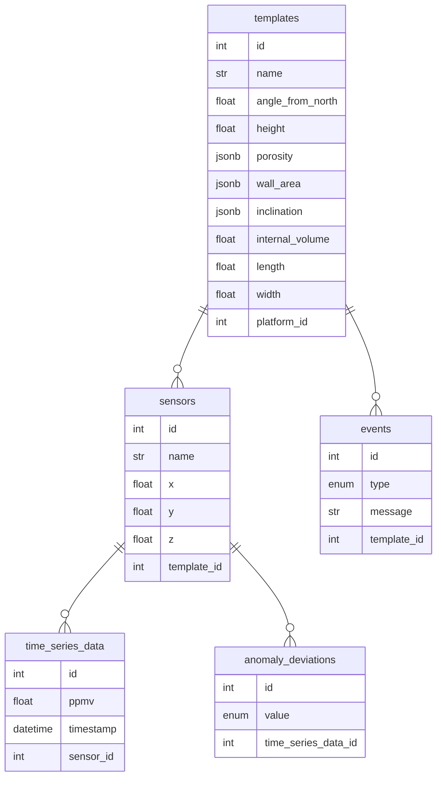

# Franatech

## <span style="color:#9DB7FF">About</span>

This repository is used as a main backend service for the Franatech solution.

🔌 **Application is powered by:**

- ✅ [Python3.11](https://www.python.org/downloads/release/python-3111/)
- ✅ [Pipenv](https://pipenv.pypa.io)
- ✅ [SQLite3](https://www.sqlite.org/index.html)
- ✅ [Docker](https://docs.docker.com)
- ✅ [Gunicorn](https://gunicorn.org)
- ✅ [Uvicorn](https://www.uvicorn.org)
- ✅ [FastAPI](https://fastapi.tiangolo.com)
- ✅ [SQLAlchemy](https://www.sqlalchemy.org)
- ✅ [Alembic](https://alembic.sqlalchemy.org)
- ✅ [Pydantic](https://pydantic-docs.helpmanual.io)
- ✅ [Loguru](https://loguru.readthedocs.io)

<br>

🔌 **Code quality tools:**

- ✅ [ruff](https://beta.ruff.rs/docs/)
- ✅ [black](https://github.com/psf/black)
- ✅ [isort](https://github.com/PyCQA/isort)
- ✅ [mypy](https://github.com/python/mypy)
- ✅ [pytest](https://github.com/pytest-dev/pytest)

<br>

# Setup the project for development

### <span style="color:#9DB7FF">1. Clone the project</span>

```bash
git clone ...
```

### <span style="color:#9DB7FF">2. Adjust environment variables ⚙️</span>

Project is configured via environment variables. You have to export them into your session from which you are running the application locally of via Docker.

All default variables make it possible to run the application without any extra steps.

<i>Default variables are stored in the `.env.default`</i>

<b>✋ Mandatory: create the `.env` file</b>

```bash
cp .env.default .env
```

Some environment variables <b>COULD</b> have a double underscore `__`. It uses in [nested setting](https://pydantic-docs.helpmanual.io/usage/settings/) that are provided by Pydantic.

<br>

## 👨‍🦯 <span style="color:#9DB7FF">Setup the project 🔨</span>

1. Install the Pipenv ➕

```bash
pip install pipenv
```

2. Install dependencies ➕

```bash
# Activate the virtual environment
pipenv shell

# Install all dependencies from the Pipfile.lock
pipenv sync --dev
```

> ⚠️ Dependencies are locked with `--pre` option, since the `stumpy` package raises the error on installation step.
> it will be fixed after the MVP _(Anaconda usage)_

<br>

✋ **NOTE:** if you don't use `pipenv`, remember that variables won't be exported from your `.env` file automatically.
🔗 [Pipenv docs](https://docs.pipenv.org/advanced/#automatic-loading-of-env)

3. Setup the database 🗃️

```bash
alembic upgrade head
```

4. Run the application ✅

```bash
uvicorn src.main:app --reload
```

<br>

## 💼 <span style="color:#9DB7FF">Additional</span>

### Tools selection reasons:

- The PostgreSQL is used because of the array field that is mandatory for saving the data for the anomaly detection processing (_matrix profile_)

### Project layout

For more details read about [DDD](https://en.wikipedia.org/wiki/Domain-driven_design)

```bash
└─ leak_detection_backend       # Project root
    ├─ .gitignore               # Exclude files and directories that match patterns in it before Git will index the root
    ├─ .env.default             # Contains default project configurations
    ├─ .pyproject.toml          # Development dependencies configuration file
    ├─ Pipfile                  # The Pipenv configuration file for managing dependencies
    ├─ Pipfile.lock             # Managed by the Pipenv automatically
    ├─ alembic.ini              # The alembic (migration tool) configuration file
    ├─ Makefile                 # Contains Bash scripts for comfortable work from the terminal
    ├─ logs                     # Local folder that aggregates all application logs
    ├─ seed                     # Contains seed files that are mandatory for running the application
    ├─ http                     # Contains Api endpoints requests examples
    ├─ mock                     # The mock data for running the application in `Debug` mode
    └─ src                      # The sources root
        ├─ presentation         # Includes controllers that represent each application entrypoint
            ├─ platforms        # Platforms API endpoints
            └─ templates        # Templates API endpoints
        ├─ application          # Operation layer outlines the business features on the highest level
            ├─ tsd              # Time series data global feature package
            ├─ database         # Includes database operations on the high level such as transaction, ...
            └─ data_lake        # Includes the producer/consumer implementation for this project
        ├─ domain               # Includes sub-domains that include entities, values-objects, aggregates and services
            ├─ tsd              # Time series data sub-domain
                ├─ repository   # Repository pattern implementation
                ├─ constants    # Specific time series data constants
                ├─ services     # Includes specific platofms services
                └─ models       # Includes all kind of entities, contracts, values-objects, etc
            └─ platforms        # Platforms sub-domain
        ├─ infrastructure       # Contains services, factories and components that are needed by domain and presentation layers
            ├─ application      # Application components (framework factories, shared entities(aggregates, values objects))
            ├─ errors           # Application errors
            ├─ models           # Shared models
            ├─ constants        # Shared constants
            └─ database         # Database components (migrations, session factories, etc...)
                └─ migrations   # Managed by the migration tool automatically
        ├─ static               # Static files for the frontend layer: CSS, JS, Images
        └─ templates            # Includes Jinja2 templates for the Server-side rendering
```

<br>

### Working with migrations <i>(Alembic)</i>

<b>Generate a new migration file based on SQLAlchemy models</b>

```bash
alembic revision --autogenerate -m "MESSAGE"
```

<b>Upgrade database according to the last version of migrations</b>

```bash
alembic upgrade head
```

<b>Downgrade to the specific migration version</b>

```bash
alembic downgrade 0e43c346b90d
```

<i>P.S. This hash is taken from the generated file in the migrations folder</i>

<br>

<i>💡 Do not forget that alembic saves the migration version into the database. Then, when you do crusial database updates you might need to remove the revision ID from the database.</i>

```bash
sqlite3 leak_detection.sqlite3
> delete from alembic_version;
```

<br>

### Glossary 📚

| Name              | Description                                                                                                                                                                      |
| ----------------- | -------------------------------------------------------------------------------------------------------------------------------------------------------------------------------- |
| Domain            | The group that describes the leak detector application in general                                                                                                                |
| Sub-domain        | One from the domain's parts. The main sub-domain in the domain is **TSD**                                                                                                        |
| Platform          | The specificplatform that installs layouts _(includes logic regarding the data source for that specific platform. Currently known platforms: Trestakk, Snorre, Troll, Askeladd)_ |
| Template          | The template layout _(describes the logic that is related to the subsea physical layout for installing sensors)_                                                                 |
| Sensor            | The physical sensor that is used for generating the data which can be fetched via OMNIA API                                                                                      |
| TSD               | Time series data _(correspondes to the data that is fetched from the sensor)_                                                                                                    |
| Anomaly detection | It takes the TSD for providing the deviation base on the **Base line** : _Ok_, _Warning_, _Critical_                                                                             |
| Simulation        | If the anomaly detection sub-domain returns the Critical deviation - the simulation module starts working. It uses the phisical environment information for simulating the leak  |
| Estimation        | Provides the estimation of a leakage basing on the simulation response. Basically it is a part of a whole Simulation feature since there is no sense having it separate          |

<br>

### Database relational structure 🗄️️


